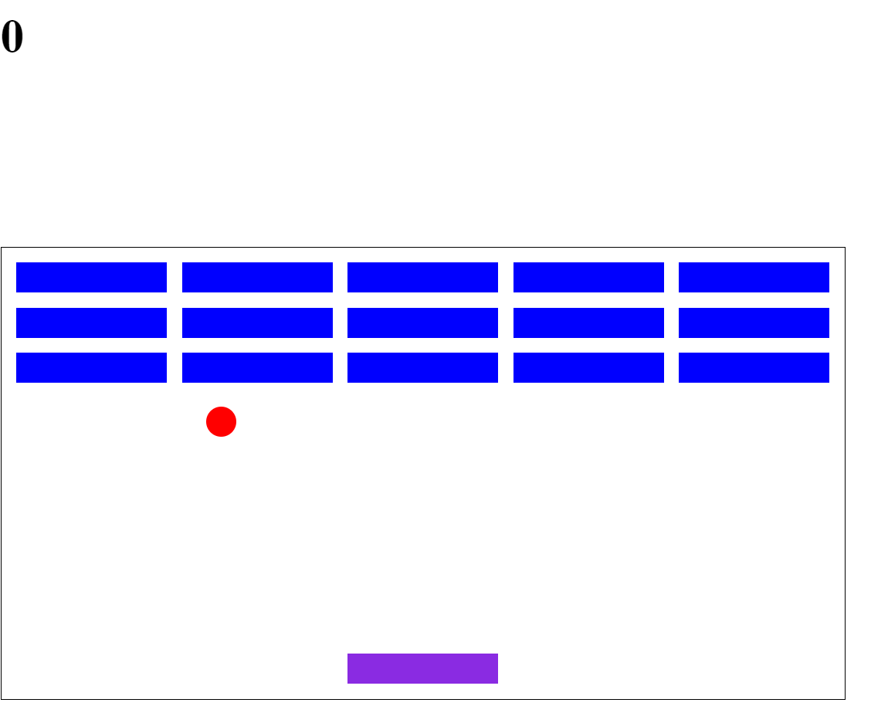
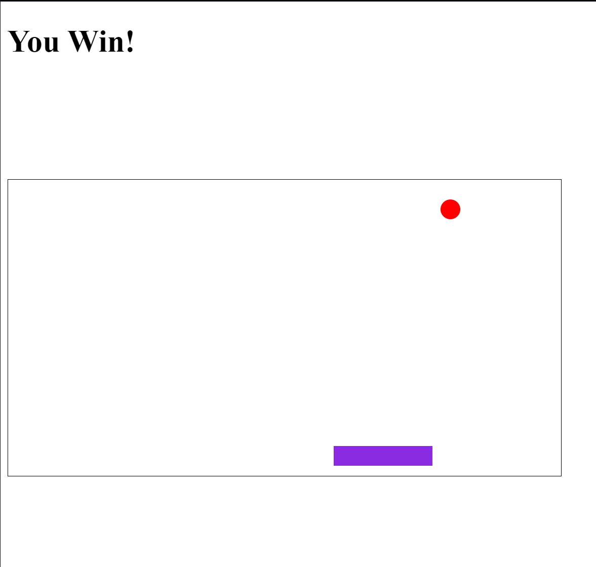
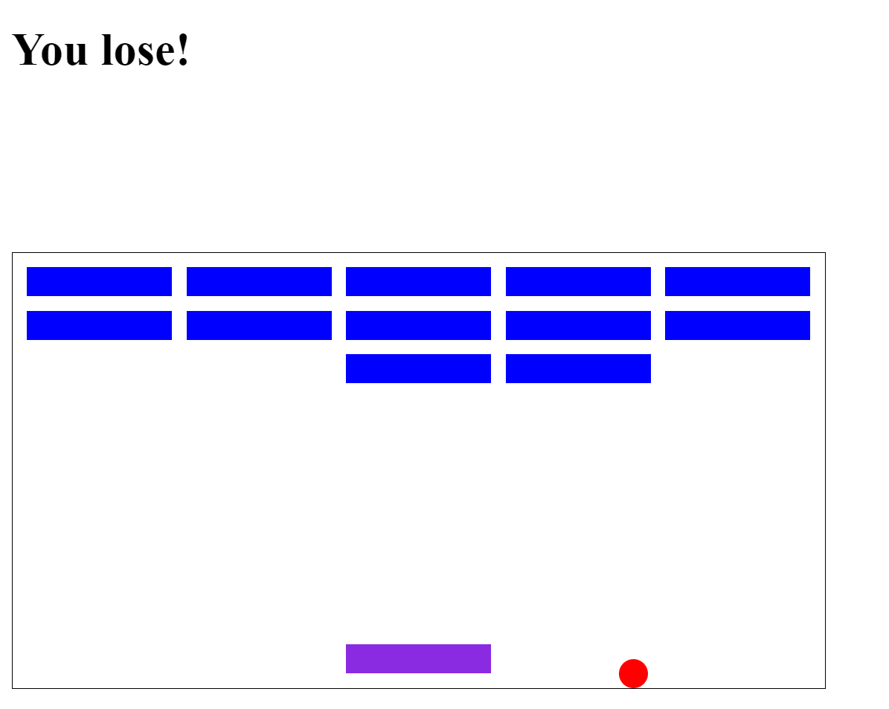

# 2D Breakout Game

A web-based **2D Breakout** game implemented using **HTML**, **CSS**, and **JavaScript**. Players control a paddle at the bottom of the screen to bounce a ball and break bricks. The objective is to clear all bricks while keeping the ball from falling off the screen.

## Features

- **Responsive Gameplay**: Enjoy a smooth experience on both desktop and mobile devices.
- **Paddle Control**: Move the paddle with keyboard arrow keys.
- **Dynamic Ball Movement**: Realistic ball bounce and collision physics.
- **Scoring System**: Earn points for each brick broken.
- **Game States**: Displays win or game-over messages based on player performance.
- **Restart Game**: Restart the game easily with a button click.

## How to Play

1. **Open the game** in your browser.
2. **Control the paddle** using the left and right arrow keys.
3. **Bounce the ball** off the paddle to break the bricks.
4. **Avoid missing the ball**, as it will end the game.
5. **Clear all bricks** to win the game.

## Demo

Check out the live demo of the project [here](https://sanskargupta0.github.io/2D-Breakout/).



## Installation

1. **Clone the repository** or download the source code:
    ```bash
    git clone https://github.com/Sanskargupta0/2D-Breakout.git
    ```

2. **Navigate to the project folder**:
    ```bash
    cd 2D-Breakout
    ```

3. **Open `index.html`** in your web browser:
    ```bash
    open index.html
    ```

## Technologies Used

- **HTML5 Canvas**: Used to render the game graphics.
- **CSS3**: Provides layout and basic styling.
- **JavaScript**: Implements the game logic including movement, collision detection, and scoring.

## Game Mechanics

- **Ball Movement**: The ball moves continuously and changes direction upon collision.
- **Collision Detection**:
  - **Walls**: The ball bounces back when hitting the left or right walls.
  - **Ceiling**: The ball bounces down when hitting the top.
  - **Paddle**: The ball bounces up when hitting the paddle.
  - **Bricks**: Bricks break upon contact, and the score increases.
- **Score Display**: Updated as bricks are broken.
- **Game Over**: Triggered when the ball falls below the paddle.
- **Victory**: Displayed when all bricks are cleared.

## Future Enhancements

- **Power-Ups**: Introduce features such as paddle extensions or multi-ball.
- **Multiple Levels**: Add more levels with different brick patterns and speeds.
- **Sound Effects**: Include sound for ball collisions and brick breaking.
- **High Score Board**: Store and display high scores using local storage.

## Screenshots

### Game Start


### In-Game Action


### Game Over Screen


## Contributing

Contributions are welcome! Feel free to fork the repository, make improvements, and submit a pull request.

## License

This project is licensed under the MIT License. See the [LICENSE](LICENSE) file for more information.

## Acknowledgments

- Inspired by the original **Breakout** arcade game.
- Special thanks to online game development tutorials and the open-source community for their invaluable resources.

---

Challenge your reflexes and enjoy the classic **2D Breakout Game**! 🕹️✨


